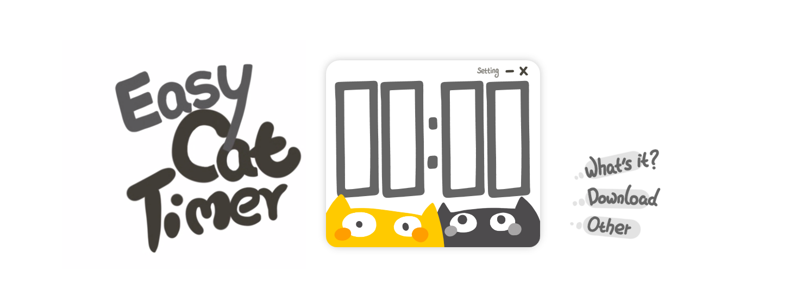

# Easy Cat Timer (web)
This is a very simple cat timer, made using **HTML+CSS+TypeScript**.

 

 

## Feature

Easy Cat Timer is a simple countdown software.

You only need to enter a number, click the [Start] button, and the countdown will begin!It's that simple!

 

**Start using this timer:**

English:  https://easycattimer.com/

Chinese:  https://cn.easycattimer.com/

 

**Feature:**

- Very simple (only countdown function)
- Very cute
- Support two languages: Chinese, English
- Have detailed script comments（Currently only Chinese，Will add English as soon as possible）
- Support mobile devices（Mobile phone, ipad, etc.）

 

 

 

## Introduction

**You only need to enter a number, click the [Start] button, and the countdown will begin!**

**You can go busy with something else. If the time is up, the software will remind you.**

**It's that simple!**

Easy Cat Timer is a software for counting down.

If you are looking for a timer software (countdown) , then you can try this Easy Cat Timer software!

 

 

 

## What is the use?

Countdown.

 

But maybe it can help you work and learn better.

I usually work 25 minutes and rest for 5 minutes.

So I need a timer to help me.

Before working, I will set a 25 minute countdown and start working. When the alarm goes off, I will put down my work and take a break.

This method of work is called "the Pomodoro Technique", and you may try this method as well.

Now, you can use this software to start a new countdown right away~

 

In addition, there are 2 cute kittens in this software. I hope this lovely timer can bring you some relaxation and happiness when you work and study.

 

 

 

## FAQ

**(1)  Why is the countdown inaccurate?**

Maybe you used your mobile phone (or tablet) to visit this web page.

Therefore, when your device lock-screen, the browser will stop running this web page, so the countdown will pause.

(We recommend that you use a computer to visit this web page, so that you can get the best experience.)

 

**(2)  Why can't this webpage display or use normally?**

Because a lot of html5 code is used in the web page, and IE browser (and some earlier versions of browsers) does not support html5 code, it cannot be displayed normally.

The latest versions of browsers such as Chrome, Edge, Opera, and Firefox can all display (and use) this webpage normally.

 

**(3)  Why can I still visit this website without connecting to the Internet?**

Because I don't have a lot of funds, I can't rent a good server... However, in order to make your visit more comfortable, I use html5 offline-application technology in the web page.

In this case, when you visit this webpage for the first time, the browser will cache the resources in the web page. Therefore, the next time you visit this web page, you will be able to visit this webpage quickly.

In other words, as long as you have visited this webpage once, you can access this webpage normally even after the network is disconnected (because the resources in the webpage are cached).

 

 

 

## Project structure

**Folder description:**

| Folder   | Description                                         |
| -------- | --------------------------------------------------- |
| project  | The web file                                        |
| document | document files（It’s okay to delete it directly!~） |

 

 

 

## Desktop version

**Easy Cat Timer (web)** is a web version of Easy Cat Timer software.

There is also a desktop version of Easy Cat Timer software, if you want to know more, please see here:

https://github.com/xujiangjiang/Easy-Cat-Timer

 

 

 

## Creator

**Design、Art、Program**: 絮大王

**Special thanks**: 瓜指导

**Thank**: My family,小木, Pw, Amir Ammari, 原浩程, Felix, [TBR]Flaming, 乐乐, UEMion

 

 