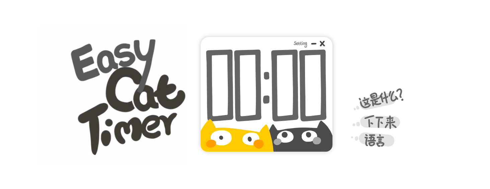

# Easy Cat Timer (web)
这是一个非常简单的猫咪计时器，使用**HTML+CSS+TypeScript**制作。

 

 

## 特色

Easy Cat Timer是一款简单的倒计时软件。

你只需要输入一个数字，然后点击[开始]按钮，倒计时就开始啦！就是这么简单呢！

 

**你可以直接访问这个网站，开始使用这个计时器：**

英文：https://easycattimer.com/

中文：https://cn.easycattimer.com/

 

**软件特色：**

- 非常简单（只有倒计时的功能）
- 非常可爱
- 支持2种语言（英文、中文）
- 有详细的中文注释
- 支持移动端

 

 

 

## 介绍

**你只需要输入一个数字，然后点击[开始]按钮，倒计时就开始啦！**

**你可以去忙一些别的事情，如果时间到了，软件会提醒你。**

**就是这么简单呢！**

Easy Cat Timer是一款用于倒计时的软件。

如果你正在寻找一个计时器（倒计时）软件，那么你可以试试这款Easy Cat Timer软件哒！

 

 

 

## 这个软件有什么用？

倒计时。

 

但是，或许它可以帮助你更好的工作和学习。

我一般会工作25分钟，休息5分钟。

所以我需要一个计时器，来帮助我计时。

在工作之前，我会设定一个25分钟的倒计时，然后开始工作。当闹钟响起的时候，我就会放下手上的工作，好好休息一下。

这种简单的工作方法被称之为“番茄工作法”，也许你也可以试试这种方法。

现在，用这个软件，马上开始一个新的倒计时吧~

 

另外，软件上有2个可爱的小猫咪。希望这个可爱的计时器，可以在你工作、学习的时候，带给你一些轻松和快乐。

 

 

 

## FAQ

**1、为什么我的倒计时不准确？**

也许你是使用手机（或者平板电脑）访问的这个网页。

因此，当你的设备锁屏或者息屏的时候，浏览器就会 停止运行这个网页，所以倒计时就暂停了。

我们还是推荐您使用电脑，来访问这个网页，这样可以获得最好的体验。

 

**2、为什么这个网页无法正常显示（或者正常使用）？**

因为网页中用了很多html5的代码，而IE浏览器（和一些浏览器的较早版本）不支持html5代码，所以就无法正常显示了。

Chrome、Edge、Opera、Firefox等浏览器的最新版本，都可以正常显示（和使用）这个网站。

 

**3、为什么我没有联网，仍然可以访问这个网站？**

因为我没有很多资金，所以不能租到很好的服务器……但是，为了让您浏览的更舒适，所以我在网页中使用了html5的离线缓存技术。

这样的话，当你第一次浏览这个网页的时候，浏览器会把网页中的资源缓存下来。因此，在你下一次访问这个网站的时候，就能够很快的打开这个网站。

也就是说，只要你访问过一次这个网站，之后即便是断网的情况下，也可以正常访问这个网站（因为网站中的资源被缓存下来了）。

 

 

 

## 项目结构

**文件夹说明：**

| 文件夹   | 描述                                 |
| -------- | ------------------------------------ |
| project  | web文件                              |
| document | 相关的文档 （直接删掉也没关系哒！~） |

 

 

 

## 桌面版本

Easy Cat Timer (web)是一个Easy Cat Timer软件的网页版本。

Easy Cat Timer软件还有一个桌面版本，如果想了解详情，请看这里：

https://github.com/xujiangjiang/Easy-Cat-Timer

 

 

 

## 制作者名单

**美术、程序**：絮大王

**特别感谢**：瓜指导

**感谢**：我的家人、小木、Pw、Amir Ammari、原浩程、Felix、[TBR] Flaming、乐乐、UEMion

 

 